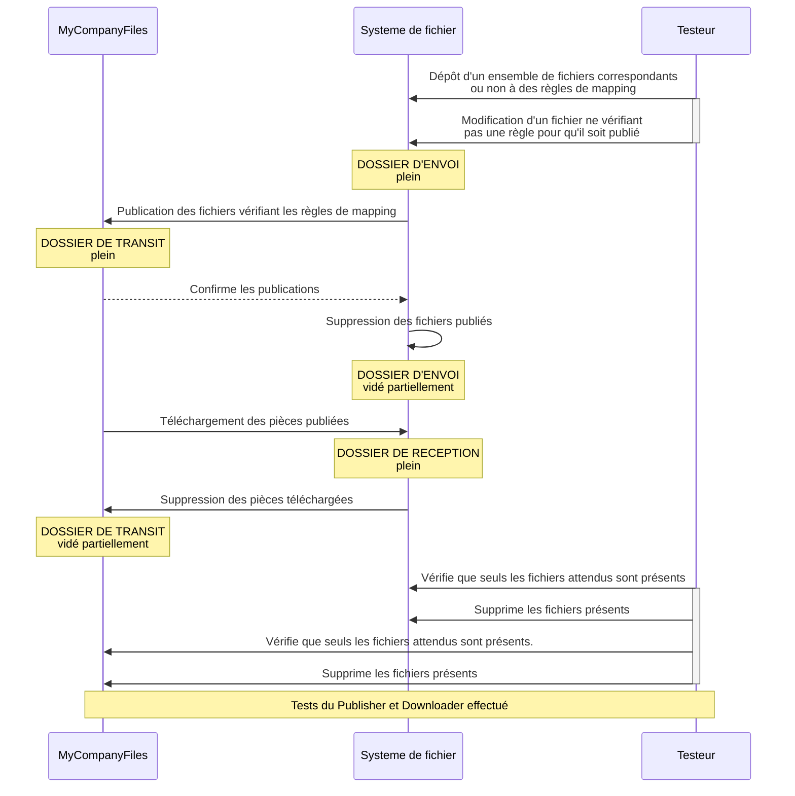

# Tests du Publisher et Downloader

[toc]

## Process de test

## Cas à tester

### Publisher : 

- All : 
  - Déplacement entraine publication
  - Nouveau client entraine rescan complet du client

- GED : 
  - Case à cocher entraine publisher
  - Modification métadonnées entraine publication

- Files :
  - Couper/coller entraine publication et suppression
  - Copier/Coller entraine publication
  - Ajout d'un mot clé entraine la publication

### Downloader :

- Téléchargement
- Suppression après téléchargement
- Déplacement après téléchargement
- Tag après téléchargement
